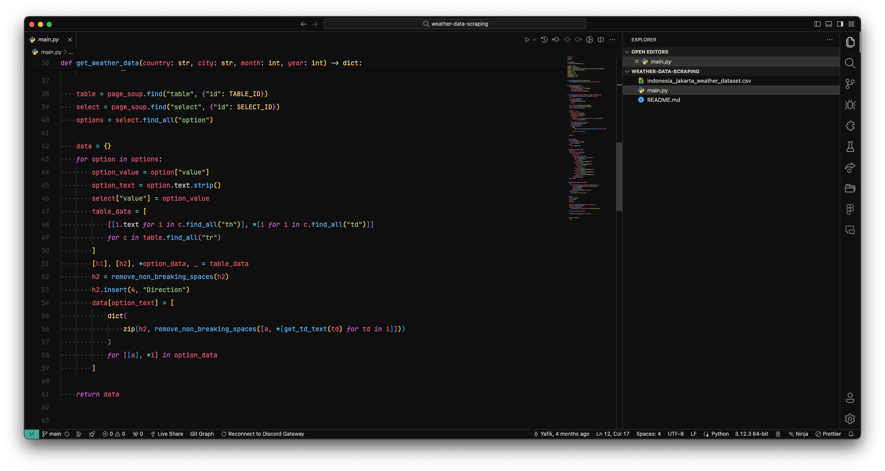
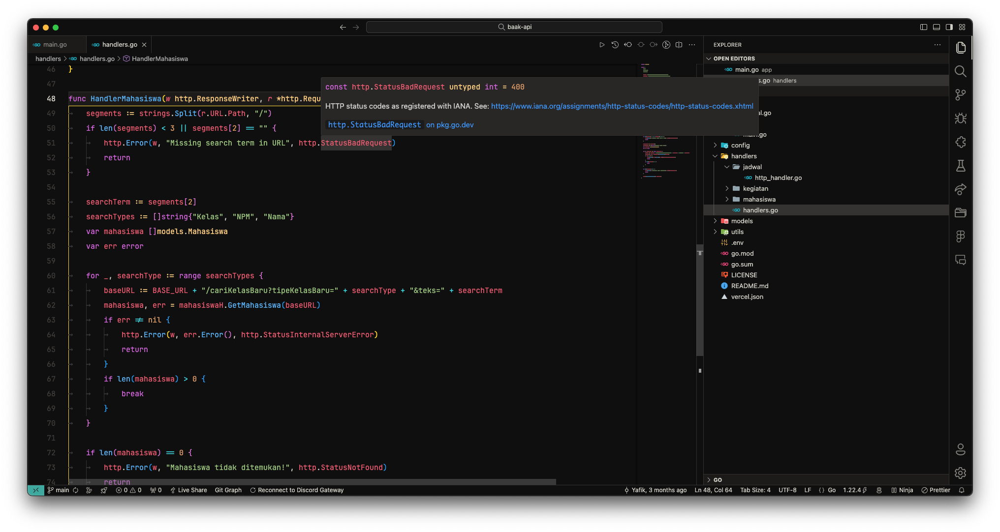

# One Dark Flexoki

Combination of One Dark Pro and [`Flexoki`](https://github.com/kepano/flexoki).

## Screenshots

Font: [`JetBrains Mono`](https://www.jetbrains.com/lp/mono/), Size: `15`, Line Height: `2`

Render Whitespace: `Boundary`

Bracket Pair Colorizer: `True`

File Icon Theme: [`Material Icon Theme`](https://marketplace.visualstudio.com/items?itemName=PKief.material-icon-theme)

Product Icon: [`Fluent Icons`](https://marketplace.visualstudio.com/items?itemName=miguelsolorio.fluent-icons)

